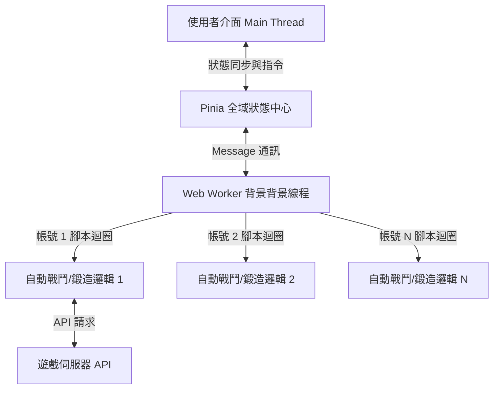

# Auto-GAO 效能優化與架構重構分析報告

本報告針對 `Auto-GAO` 專案在**瀏覽器多開（多帳號）**與**大量物品數據（武器/裝備）**情境下所面臨的效能瓶頸進行深入盤點與分析，並提出相應的架構重構與優化策略，以維持在瀏覽器平台運行的最佳體驗。

---

## 1. 現狀效能瓶頸分析

當使用者在瀏覽器中**多開分頁**或**處理大量裝備數據**時，主要的效能負擔源自以下幾個維度：

### 1.1 瀏覽器多開分頁（Multi-tab）的極高開銷
*   **進程與記憶體重疊**：每個瀏覽器分頁都是一個獨立的 OS 進程，會重複加載整個 Vue 運行時、Element Plus UI 庫、Axios 客戶端及所有靜態資源，當多開 10+ 個分頁時，記憶體與 CPU 佔用呈線性暴增。
*   **瀏覽器背景凍結（Tab Throttling）**：現代瀏覽器（Chrome、Edge 等）會自動限制非活動分頁的 JS 定時器（如 `setInterval` 和 `setTimeout` 最小間隔會被拉長至 1 秒甚至被暫停）。這會導致背景運作的自動戰鬥腳本時間不精準、API 請求被掛起或斷線。

### 1.2 大量裝備/武器渲染的 DOM 瓶頸
*   **DOM 節點過載**：在 `WeaponSelect.vue` 或 `AutoRecycle.vue` 中，若玩家背包擁有數百甚至數千件裝備，Vue 會為每件裝備渲染對應的 Checkbox 或 Table Row。大量的 DOM 節點會嚴重拖慢瀏覽器的 Patch & Paint 流程，導致點擊展開或搜尋時產生明顯卡頓。
*   **頻繁的反應式（Reactive）計算**：當裝備陣列非常龐大時，對其進行 `.filter()` 或 `.find()` 等計算屬性（Computed）的重新求值，會在 Vue 的反應式依賴追踪中產生大量 CPU 開銷。

### 1.3 業務邏輯與 UI 生命週期高度耦合
*   **組件卸載導致腳本中斷**：目前的自動化腳本狀態（例如 `scriptStatus`、戰鬥循環的 `while` 迴圈）是直接宣告在 Vue 組件（如 `AutoBattle.vue`）內。當使用者切換帳號或導航到其他頁面時，組件被卸載，背景任務就會被強行中斷。
*   **全域 UI 提示阻塞**：自動化邏輯（如 `autoBattleChecker.js`）直接調用了 `ElMessage` 來彈出通知。若此邏輯未來要移入非 UI 線程，這些對 DOM/Window 的依賴會直接引發異常。

---

## 2. 效能優化策略

為了解決上述瓶頸，我們提出以下技術優化路徑，確保專案能以最省資源的方式在瀏覽器中穩定執行：



### 2.1 引入 Web Workers 進行背景多線程處理（核心優化）
*   **解決方案**：將所有的自動化迴圈、冷卻時間計算（Sleep）、以及 API 請求（Axios 呼叫）移至 **Web Worker** 中執行。
*   **優勢**：
    1.  **不受背景凍結影響**：Web Workers 運作在獨立於主線程的背景線程中，其定時器不會受到瀏覽器分頁休眠機制的影響，能保證 100% 精準的執行間隔。
    2.  **主線程零卡頓**：即使有數十個帳號在背景進行複雜的戰鬥與鍛造邏輯計算，UI 依然能保持 60 FPS 的流暢操作。

### 2.2 從「多開分頁」轉向「單頁多帳號並行」
*   **解決方案**：在全域狀態管理器（建議使用 Pinia）中，維護一個運作中的帳號任務陣列。每個帳號對應一個背景腳本實例。
*   **優勢**：
    *   使用者只需打開**一個瀏覽器分頁**，即可在該分頁的儀表板中同時管理、監控並運行所有帳號的自動化腳本。
    *   記憶體佔用可從原本多開分頁的數 GB 驟降至幾百 MB。

### 2.3 採用虛擬滾動（Virtual Scrolling）與懶加載
*   **解決方案**：
    *   在裝備選擇和回收列表上引入虛擬滾動技術（例如使用 `el-table` 的虛擬滾動或 `vue-virtual-scroller`）。
    *   **原理**：不論裝備庫有 1,000 件還是 10,000 件，DOM 樹中永遠只渲染可見區域的 10~20 個節點，滾動時動態複用 DOM 元件。這能將渲染時間縮短 95% 以上。

### 2.4 快取優化與防抖防過載
*   **防呆過濾快取**：對於 `WeaponSelect.vue` 中的搜尋過濾，加上防抖（Debounce）處理，避免使用者每輸入一個字就觸發大數組的重過濾。
*   **靜態對照表本地化**：將地圖資料（`mapping.js`、`specialMap.js`）等靜態對照表存入瀏覽器的記憶體快取，不隨每一次的檢測重新解析。

### 2.5 API 呼叫頻率安全延遲機制 (Rate Limiting & Safety Delays)
*   **重要性**：在進行「單頁多帳號並行」或「Web Worker 背景多線程」改寫時，因為多個帳號同時運行，**絕不能忽略 API 呼叫的安全延遲（Sleep Mechanism）**。如果呼叫頻率太高，會觸發遊戲伺服器的頻率限制（Rate Limit），進而導致 Token 被鎖定或封帳號。
*   **解決方案**：
    1.  **帳號獨立限流與冷卻**：每個帳號必須有獨立的 API 發送冷卻隊列，強制規定請求與請求之間最少需間隔 **1.5 ~ 3 秒**。
    2.  **腳本運作安全延遲**：在自動戰鬥、自動鍛造、自動回收等邏輯步驟之間，強行插入隨機的微小延遲（例如 `1.5s + Math.random() * 1s`），模擬真人行為並防止被後端防作弊機制識別。
    3.  **背景向 UI 通訊節流**：Worker 在背景執行時，只在角色數值有顯著變動或定期（如每 5 秒）才向主線程發送一次資料同步，避免頻繁的 `postMessage` 帶來通訊開銷。

---

## 3. 架構重構與資料夾分類規劃

為了配合效能優化，並解決現有程式碼 JS 與 TS 混用、邏輯與 UI 耦合的問題，建議將目錄結構調整如下：

### 3.1 建議目錄結構（TypeScript 規範）
```text
auto_GAO/
├── docs/                      # 專案文檔與報告
├── public/                    # 靜態資源
└── src/
    ├── api/                   # 純 API 介接層 (封裝 Axios 請求)
    │   └── user.ts            # 改寫為 TS 類型安全的 API 客戶端
    ├── assets/                # 樣式與靜態圖片
    ├── common/                # 靜態字典與工具函式
    │   ├── constants.ts       # 整合原本的 mapping, medicineList, typeList 等
    │   └── sleep.ts           # 延遲工具
    ├── components/            # 封裝好的「純 UI 組件」(不包含自動化邏輯)
    │   ├── AccountSidebar.vue # 側邊欄帳號列表
    │   ├── DashboardCard.vue  # 角色狀態卡片
    │   └── WeaponSelect.vue   # 裝備選擇器 (引入虛擬滾動)
    ├── core/                  # 自動化核心引擎 (純 JS/TS 類別，無 DOM 依賴)
    │   ├── AutomationManager.ts # 後台任務調度器 (管理多帳號腳本)
    │   ├── battleEngine.ts    # 自動戰鬥引擎
    │   └── forgeEngine.ts     # 自動鍛造引擎
    ├── router/                # 路由配置
    ├── store/                 # 狀態管理
    │   ├── index.ts           # Pinia 配置
    │   └── accountStore.ts    # 存放帳號狀態與背景任務調度的 Pinia Store
    ├── views/                 # 頁面視圖
    │   ├── HomeView.vue       # 主控台儀表板
    │   └── LogView.vue        # 全域日誌觀察頁面
    ├── workers/               # Web Worker 實作程式碼
    │   └── automation.worker.ts # 負責背景輪詢與 API 請求的 Worker
    ├── App.vue                # 入口組件
    └── main.ts                # 專案入口
```

### 3.2 關鍵架構調整說明
1.  **邏輯與 UI 完全分離**：
    *   將 `src/common/autoBattleChecker.js` 重構為 `src/core/battleEngine.ts`。
    *   移除所有 UI 直接依賴（如 `ElMessage`），改用自定義的事件機制（如 `onLog(msg)`、`onError(err)`），由主線程的 Store 訂閱並觸發 Element Plus 提示。
2.  **統一 TypeScript 開發**：
    *   將全專案改寫為 TypeScript。例如為裝備（`Equipment`）、角色資料（`Profile`）、設定（`Setting`）定義明確的 `interface`，避免在傳遞參數時因屬性未定義而發生 `Cannot read properties of undefined` 的錯誤。

---

## 4. 優化實施優先級建議

| 優先順序 | 優化項目 | 預估效能提升 | 實施難度 | 說明 |
| :---: | :--- | :---: | :---: | :--- |
| **1** | **組件邏輯與腳本狀態解耦** | ⭐⭐⭐量 | 中 | 將腳本啟動/停止狀態移至 `accountStore.ts`。即使切換組件，背景任務也能繼續執行，避免多開分頁。 |
| **2** | **裝備列表引入虛擬滾動** | ⭐⭐⭐⭐⭐ | 低 | 解決數百件裝備加載時的 DOM 渲染卡頓，立竿見影。 |
| **3** | **改寫為 TypeScript 並定義型別** | ⭐⭐⭐ | 中 | 消除 `Cannot read properties of undefined` 等隱式錯誤，提升維護效率。 |
| **4** | **引入 Web Worker 背景執行** | ⭐⭐⭐⭐⭐ | 高 | 徹底解決瀏覽器背景分頁休眠、定時器不準與 CPU 搶佔的問題。 |

---
**報告產出時間**：2026-06-16
**分析人員**：Antigravity (Google DeepMind Team)
